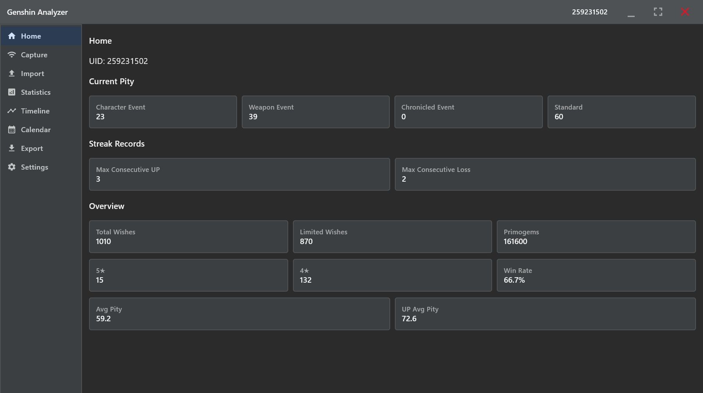
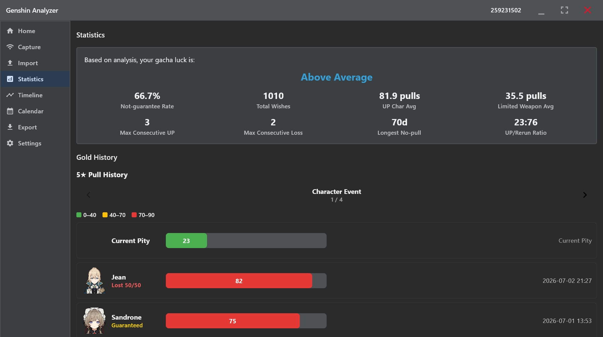
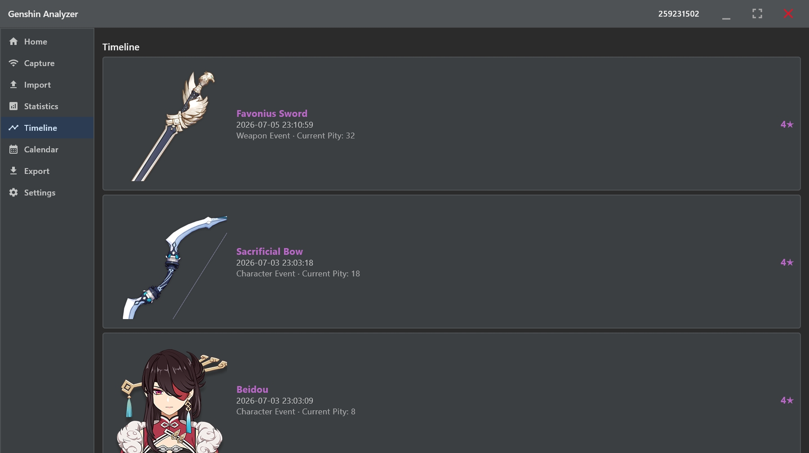
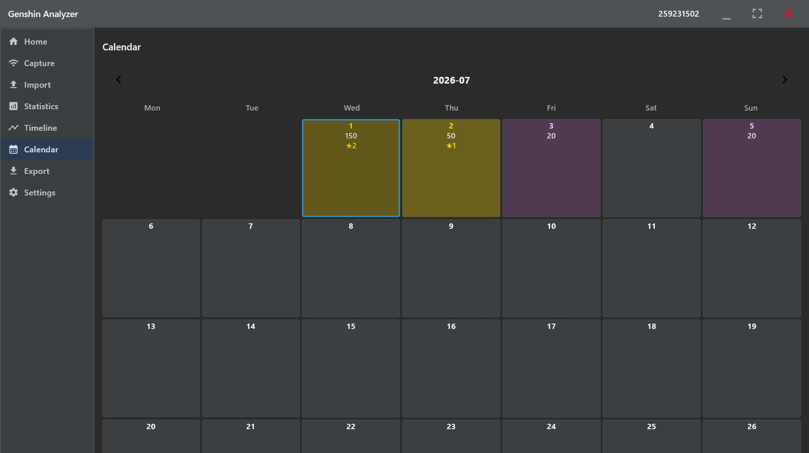
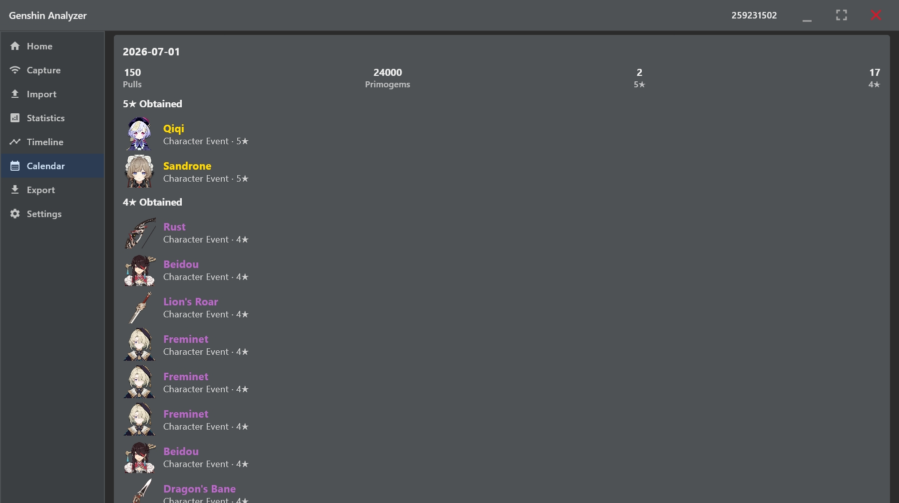

# Genshin-Analyzer-NEXT · 原神抽卡助手

[中文](#中文介绍) | [English](#english-introduction) | [截图 / Screenshots](#screenshots)

## 中文介绍

作者是 ECE (Uwaterloo 31') 学生，也是一个原神玩家。最初是为了整理自己的抽卡记录并且不再依赖于微信服务/其他平台，实现一个本地的 Desktop App。
程序将记录采集、导入、存储、统计与导出整合在一起，方便回顾抽卡历史、查看当前抽数，以及每隔卡池的抽卡结果。

界面使用 Kotlin 和 Compose Desktop 构建，结合 Java、SQLite 与 Node.js 代理服务。本文档仅说明 Windows 环境下的构建和启动方式。本应用也仅限于
windows 10+的环境。

### 主要功能

- **记录采集与导入**：通过本地代理获取游戏内抽卡历史；也可导入 JSON 文件，并进行校验、去重和合并（需要遵守 UIGF 格式）。
- **多账号管理**：按 UID 存储记录，并在界面中切换账号。
- **抽卡统计**：查看总抽数、五星与四星数量、平均出金抽数、当前垫抽数等。
- **可视化**：通过时间线、日历、出金历史图表和月度原石消耗统计回顾记录。
- **数据导出**：提供 JSON（界面标注为 UIGF v3.0/v4.0）、Excel、CSV 和 HTML 导出选项。尚未验证与其他社区工具的互操作性；版本说明见文末。
- **本地存储与备份**：使用 SQLite 保存数据；导入或采集前备份已有数据库。

### Windows 环境准备

| 项目 | 要求或当前配置 |
| --- | --- |
| 操作系统 | 主要在 Windows 11 上测试，未区分具体版本类别 |
| Java | 构建工具链为 JDK 25；启动脚本检查 Java 25 或更新版本 |
| PowerShell | Windows PowerShell 5.1 或 Windows 上的 PowerShell 7 |
| Gradle | 使用仓库提供的 `gradlew.bat` |
| Node.js | Gradle 配置下载 Node.js 18.16.0，并在 `proxy` 目录安装 npm 依赖 |
| 网络 | 首次构建需要下载依赖；采集记录需要连接游戏服务 |

请将 `JAVA_HOME` 指向 JDK 安装目录。启动脚本优先使用 `JAVA_HOME\bin\java.exe`，其次使用 PATH 中的 `java.exe`，并检查版本。

### 构建和启动

先在 PowerShell 中进入项目根目录（包含 `gradlew.bat` 的目录），再执行：

```powershell
.\gradlew.bat jar
powershell.exe -NoProfile -ExecutionPolicy Bypass -File .\build\libs\launch.ps1
```

构建产物为 `build/libs/Genshin-Analyzer-NEXT-1.0-SNAPSHOT.jar`。Gradle 会将 `scripts/windows` 中的启动脚本复制到 JAR 所在目录。

如果终端当前位于其他目录，请使用脚本的完整路径。例如，项目位于 `C:\GenshinTracker\tracker` 时：

```powershell
powershell.exe -NoProfile -ExecutionPolicy Bypass -File "C:\GenshinTracker\tracker\build\libs\launch.ps1"
```

请根据实际项目位置修改路径；绝对路径 `C:\...` 前不要添加 `.`。

### 创建桌面快捷方式

在项目根目录运行：

```powershell
powershell.exe -NoProfile -ExecutionPolicy Bypass -File .\build\libs\shortcut.ps1
```

完成后，双击桌面的 **Genshin Analyzer** 快捷方式即可启动。若启动脚本旁存在 `app.ico`，快捷方式会使用该图标。

两个脚本均支持 `-CheckOnly`：只检查配置，不启动程序，也不创建快捷方式。例如：

```powershell
powershell.exe -NoProfile -ExecutionPolicy Bypass -File .\build\libs\launch.ps1 -CheckOnly
powershell.exe -NoProfile -ExecutionPolicy Bypass -File .\build\libs\shortcut.ps1 -CheckOnly
```

`shortcut.ps1` 的 `-OutputDirectory` 参数可指定其他已存在的快捷方式保存目录。自定义文件布局时，`launch.ps1` 可通过 `-AppRoot` 指定项目目录，通过 `-JarPath` 指定 JAR。

### 使用流程

1. 在“导入”页面选择符合程序要求的 JSON 文件，或在“抓包”页面点击开始采集，然后按照界面提示打开游戏中的“祈愿 → 历史记录”。
2. 程序校验并合并记录后，通过 UID 选择器切换需要查看的账号。
3. 在首页、统计、时间线和日历页面查看结果。
4. 在导出页面选择需要的文件格式。

采集会临时配置 Windows 系统代理。具体操作与提示以抓包页面为准。

### 启动说明与排错

- **双击 JAR 失败，但命令行可以运行**：Windows 的 `.jar` 文件关联可能指向旧版 Java，而终端使用另一版本。启动脚本绕过该关联，选择并检查 Java，同时传入与 Gradle 运行配置一致的 `--enable-native-access=ALL-UNNAMED`。
- **找不到脚本**：相对路径以终端当前目录为起点。切换到项目根目录，或使用带引号的完整路径。
- **找不到代理文件**：启动脚本需要定位 `proxy/proxy.js`。保留项目目录结构，或通过 `-AppRoot` 指定项目根目录。
- **启动后立即退出**：查看 `build/libs/launcher-logs` 中的标准输出和错误日志；启动失败时脚本会显示错误对话框。

请保留项目内的 `build/libs`、`proxy` 及相关依赖。采集需要外部 `proxy` 目录、npm 依赖和 Node.js（优先使用 Gradle 下载的运行时，其次使用 PATH）。**单独复制 fat JAR 并不能得到完整的便携式采集程序。** 启动脚本会将项目目录设为工作目录，以便找到这些文件。

修改启动脚本时，请编辑 `scripts/windows` 中的源文件并重新构建。`gradlew.bat clean` 会删除 `build` 中生成的 JAR、脚本和启动日志。

## English introduction

Genshin-Analyzer-NEXT is a personal desktop project designed and developed by the author (A student in UWaterloo ECE 31', also a gacha gamer). It began as a way to organize personal wish records and brings collection, importing, storage, analytics, and exporting into one app. It helps users revisit their wish history, check current pity, and explore results across banners.

The interface uses Kotlin and Compose Desktop, with Java, SQLite, and a Node.js proxy service. This README currently covers building and launching on Windows only.

### Features

- **Capture and import:** capture in-game wish history requests through a local proxy, or import JSON records with validation, deduplication, and merging.
- **Multiple accounts:** store records by UID and switch accounts in the interface.
- **Wish statistics:** view wish totals, five-star and four-star counts, average pulls to a five-star, current pity, win rates, and win/loss streaks. Character event banners 301 and 400 share pity and guarantee state.
- **History views:** explore a timeline, calendar, five-star history charts, and monthly primogem consumption statistics.
- **Exports:** JSON (labeled UIGF v3/v4 in the interface), Excel, CSV, and HTML options. Interoperability with other community tools has not been verified; see the version notes below.
- **Local storage and backups:** save records in SQLite and back up an existing database before importing or capturing records.
- **Appearance and language:** Chinese and English interfaces, with light, dark, and system theme settings.

### Windows requirements

| Component | Requirement or current configuration |
| --- | --- |
| Operating system | Primarily tested on Windows 11; no specific edition is identified |
| Java | The build toolchain uses JDK 25; the launcher checks for Java 25 or newer |
| PowerShell | Windows PowerShell 5.1 or PowerShell 7 on Windows |
| Gradle | Use the included `gradlew.bat` wrapper |
| Node.js | Gradle is configured to download Node.js 18.16.0 and install npm dependencies in `proxy` |
| Network | Required for initial dependency downloads and fetching game records |

Set `JAVA_HOME` to your JDK installation directory. The launcher prefers `JAVA_HOME\bin\java.exe`, then `java.exe` on PATH, and checks the selected version.

### Build and launch

Open PowerShell in the project root (the directory containing `gradlew.bat`), then run:

```powershell
.\gradlew.bat jar
powershell.exe -NoProfile -ExecutionPolicy Bypass -File .\build\libs\launch.ps1
```

The output is `build/libs/Genshin-Analyzer-NEXT-1.0-SNAPSHOT.jar`. Gradle copies the launcher scripts from `scripts/windows` beside the JAR.

From another directory, use the full script path. For example, if your project is at `C:\GenshinTracker\tracker`:

```powershell
powershell.exe -NoProfile -ExecutionPolicy Bypass -File "C:\GenshinTracker\tracker\build\libs\launch.ps1"
```

Adjust the path to your checkout. Do not put a dot before an absolute `C:\...` path.

### Create a desktop shortcut

Run this from the project root:

```powershell
powershell.exe -NoProfile -ExecutionPolicy Bypass -File .\build\libs\shortcut.ps1
```

Double-click the resulting **Genshin Analyzer** desktop shortcut to open the app. If `app.ico` exists beside the launcher, the shortcut uses it.

Both scripts accept `-CheckOnly` to validate configuration without launching the app or creating a shortcut:

```powershell
powershell.exe -NoProfile -ExecutionPolicy Bypass -File .\build\libs\launch.ps1 -CheckOnly
powershell.exe -NoProfile -ExecutionPolicy Bypass -File .\build\libs\shortcut.ps1 -CheckOnly
```

The shortcut installer accepts `-OutputDirectory` for a different existing destination directory. For custom layouts, `launch.ps1` accepts `-AppRoot` for the project directory and `-JarPath` for the JAR.

### Using the app

1. Select a compatible JSON file on the Import page, or start capture on the Capture page and follow its instructions to open Wish → History in the game.
2. After validation and merging, select the account using the UID selector.
3. Explore Home, Statistics, Timeline, and Calendar.
4. Choose a file format on the Export page to save your records or report.

Capture temporarily configures the Windows system proxy. Follow the steps and tips shown on the Capture page.

### Launch behavior and troubleshooting

- **Double-clicking the JAR fails, but terminal launch works:** the Windows `.jar` association may use an older Java installation than your terminal. The launcher bypasses that association, selects and checks Java, and supplies `--enable-native-access=ALL-UNNAMED`, matching the Gradle run configuration.
- **Script not found:** relative paths start at the terminal's current directory. Switch to the project root or use a quoted absolute path.
- **Proxy script not found:** the launcher needs to locate `proxy/proxy.js`. Keep the project layout or supply the project root with `-AppRoot`.
- **App exits at startup:** inspect stdout and stderr logs in `build/libs/launcher-logs`. Launch failures display an error dialog.

Keep `build/libs`, `proxy`, and their dependencies within the project. Capture needs the external `proxy` directory, npm dependencies, and Node.js (the Gradle-downloaded runtime is preferred, with PATH as a fallback). **The fat JAR alone is not a complete portable capture distribution.** The launcher sets the project as its working directory so these files can be found.

Edit launcher sources in `scripts/windows`, then rebuild. `gradlew.bat clean` deletes generated JARs, launchers, and launcher logs under `build`.

<a id="screenshots"></a>

## 截图 / Screenshots

### 首页 / Home



### 统计 / Statistics



### 时间线 / Timeline



### 日历：月度概览 / Calendar: monthly overview



### 日历：每日详情 / Calendar: daily details



## 数据位置 / Data locations

程序使用 Java 的 `user.home` 作为用户目录。以下路径相对于该目录；启动日志路径相对于项目根目录。

The app uses Java's `user.home` as its user directory. The paths below are relative to that directory, except launcher logs, which are relative to the project root.

| 内容 / Content | 路径 / Path |
| --- | --- |
| 数据库 / Database | `GenshinAnalyzer/data/gacha.db` |
| 导入前备份 / Pre-import backups | `GenshinAnalyzer/data/backups/` |
| 导出文件 / Exported files | `GenshinAnalyzer/export/` |
| 配置 / Preferences | `GenshinAnalyzer/config/` |
| 启动日志 / Launcher logs | `build/libs/launcher-logs/` |

## 项目结构 / Project layout

```text
src/main/kotlin/
  analytics/     # 抽卡统计核心 / Wish computation core
  assets/        # 本地化与资源加载 / Localization and assets loading
  backup/        # 数据库 / Database
  core/          # 代理服务 / Proxy coordination
  model/         # 记录模型与解析 / Record models and parsing
  storage/       # SQLite 与导出 / SQLite and exports
  ui/            # 界面 / Compose desktop
  utilities/     # 配置与工具 / Configuration and utilities
  validation/    # 数据校验 / Record validation
src/main/java/   # 抓取与 Excel 导出 / Fetching and Excel export
src/main/resources/gacha-assets/
src/test/kotlin/
proxy/           # 代理服务闲逛 / Node.js proxy
scripts/windows/ # 启动脚本源文件 / Launcher sources
docs/images/     # README 截图 / README screenshots
build/libs/      # 生成的 JAR 与脚本 / Generated JAR and launchers
```

## 发布与格式说明 / Release and format notes

这是项目的首次正式发布，目前暂无发布或下载链接。请按照上文说明从源码构建。

This is the project's first official release. No release or download URL is available yet; use the source build instructions above.

程序提供 **UIGF v3.0 / v4.0** 格式的导出选项，但尚未与其他社区工具验证互操作性。

The app provides **UIGF v3.0 / v4.0** export options, but interoperability with other community tools has not been verified.

## 许可证 / License

本项目采用 [MIT 许可证](LICENSE)。

This project is licensed under the [MIT License](LICENSE).
